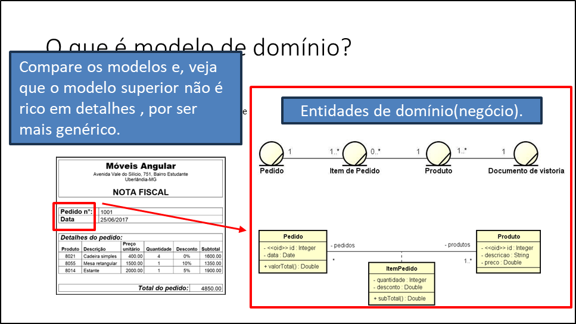
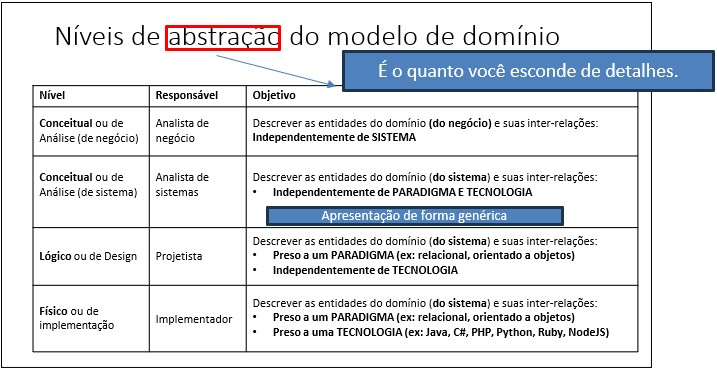

# 📚 Curso Modelagem de domínio e modelagem conceitual 🧱

O curso de Modelagem de Domínio e Modelagem Conceitual ensina a representar de forma abstrata sistemas e suas interações, identificando entidades, relacionamentos e regras de negócio. Foca em traduzir o mundo real em modelos que guiam o desenvolvimento de sistemas de informação.

- [📚 Curso Modelagem de domínio e modelagem conceitual 🧱](#-curso-modelagem-de-domínio-e-modelagem-conceitual-)
  - [🤔 Entendendo modelagem de  domínio e modelagem  conceitual](#-entendendo-modelagem-de--domínio-e-modelagem--conceitual)
    - [Modelagem de domínio](#modelagem-de-domínio)
    - [O que é modelo de domínio?](#o-que-é-modelo-de-domínio)
    - [Níveis de abstração do modelo de domínio.](#níveis-de-abstração-do-modelo-de-domínio)
    - [Níveis de abstração do modelo de domínio.](#níveis-de-abstração-do-modelo-de-domínio-1)

## 🤔 Entendendo modelagem de  domínio e modelagem  conceitual

O desenvolvimento de software é dividido em fases:

### Modelagem de domínio

---

### O que é modelo de domínio?

**Domínio:** é a área de negócio observada.

**Modelo de domínio:** é a área de negócio que descreve .
* As entidades do domínio
* As inter-relações entre elas

### Níveis de abstração do modelo de domínio.

|  Nível                                       |  Responsável         | Objetivo                   |
|:---------------------------------------------|:---------------------|:---------------------------|
|**Conceitual** ou de   análise(de negócio) | Analista de negócio  |Descrever as entidades do domínio (**do negócio**) e suas inter-relações:  **Independente de SISTEMA**|
|**Conceitual** ou de   análise(de sistema)  | Analista de sistemas |Descrever as entidades do domínio (**do sistema**) e suas inter-relações:  **\* Independente de PARADIGMA E TECNOLOGIA**|
|**Lógico** ou de Design                       | Projetista           |Descrever as entidades do domínio (**do sistema**) e suas inter-relações: **\* Preso a um PARADIGMA(ex:relacional, orientado a objetos)**  **\*  Independente de TECNOLOGIA**|
|**Físico** ou de   implementação           | Implementador        |Descrever as entidades do domínio (**do sistema**) e suas inter-relações: **\* Preso a um PARADIGMA(ex:relacional, orientado a objetos)**  **\* Preso a uma TECNOLOGIA(ex: Java, C#, etc)**|

### Níveis de abstração do modelo de domínio.

